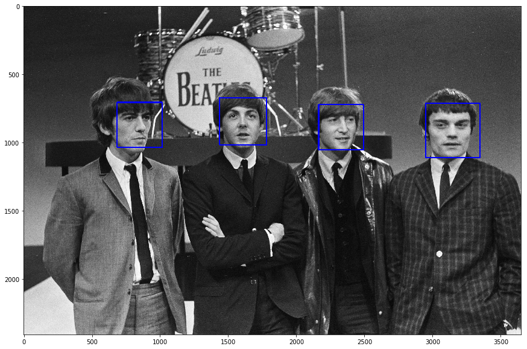
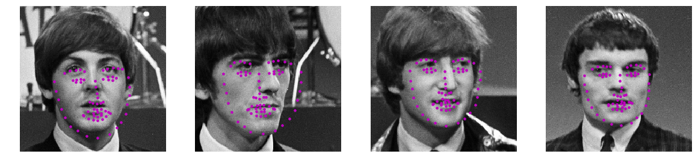

## Abstract:
Following up with the instructions from [Udacity README](README_Udacity.md), this project aims to leverage knowledge of computer vision techniques and deep learning architectures to build a full pipeline of facial keypoint detections.

## Computer Vision Pipeline:
A computer vision pipeline is a series of steps that most computer vision applications will go through. Many vision applications start off by acquiring images and data, then processing that data, performing some analysis and recognition steps, then finally performing an action.

## Workflow:

### Prerequisite
After we’ve gone through the previous step to train a neural network to detect facial features, we’ll have the network to apply to any image that includes faces.

Based on the[NaimishNet paper](https://github.com/jonathanyeh0723/Udacity-CVND-Projects/blob/master/Project%201:%20Facial%20Keypoint%20Detection/1710.00977.pdf)addressed, a CNN architecture was built for the implementation of facial key points detector.

###

For keypoint detection, a CNN architecture was chosen, similar to that described in the 

## Results:

[This notebook](https://github.com/jonathanyeh0723/Udacity-CVND-Projects/blob/master/Project%201:%20Facial%20Keypoint%20Detection/3.%20Facial%20Keypoint%20Detection%2C%20Complete%20Pipeline.ipynb) contains the full pipeline: face detection, extraction and preprocessing, and keypoint prediction, as well as the final results.

After face detection, with bounding boxes drawn around the detected faces:

After keypoint prediction, using the trained "naimishlite" model:

Placement of keypoints on some of the faces is suboptimal due to limited training time and data.

